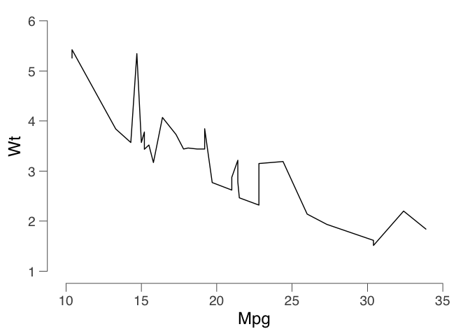
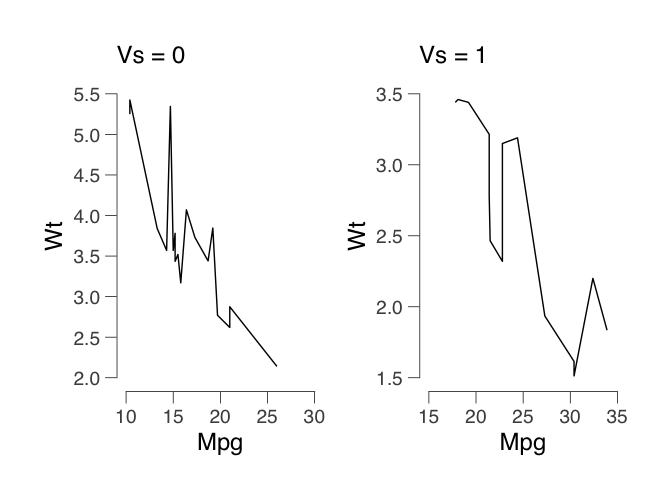

`ggRetro`
=========

`ggRetro` is a package for creating floating

Basic Usage
-----------

    library(dplyr)
    library(ggplot2)
    library(ggRetro)

    p = ggplot(mtcars) +
      geom_line(aes(mpg, wt)) +
      theme_bw()
    p |> base_mode()

    ## [1] "Both numeric"

For Facet plot
--------------

    p |> base_facet(c("vs"))

    ## [1] "Both numeric"
    ## [1] "Both numeric"

Better default theme with `oh_my_ggplot`

------------------------------------------------------------------------

    oh_my_ggplot()

    p |> base_mode()

    ## [1] "Both numeric"

